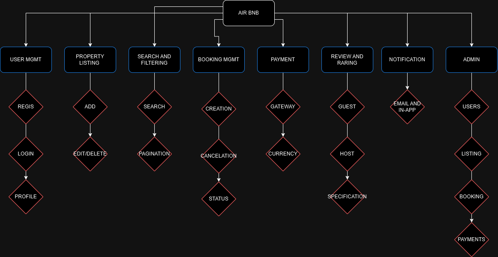

# Features and Functionalities Documentation

This directory contains the documentation of the key features and functionalities for the **Airbnb Clone** backend project.

## Objective
Identify and document the essential features and functionalities that the backend of the Airbnb Clone needs to support. This includes:
- User Authentication
- Property Management
- Booking System
- Payment Processing

## Contents
- `features-and-functionalities.png`: A PNG file exported from Draw.io, detailing the features and functionalities.
- `README.md`: This file, providing an overview of the documentation in this directory.

## Instructions
1. **Review Requirements**: Ensure that the project requirements for the Airbnb Clone backend have been reviewed.
2. **Create Document in Draw.io**:
   - Use Draw.io to create a comprehensive document listing all necessary backend features.
   - Ensure the diagram includes components such as user authentication, property management, booking, and payment systems.
3. **Export and Store**:
   - Export the design as a PNG file.
   - Place the PNG file in this directory.
4. **Commit and Push**:
   - Commit the PNG and this `README.md` to the `alx-airbnb-project-documentation` GitHub repository.

## Repository Structure
```
alx-airbnb-project-documentation/
|-- features-and-functionalities/
    |-- features-and-functionalities.png
    |-- README.md
```

## Features and Functionalities Diagram


