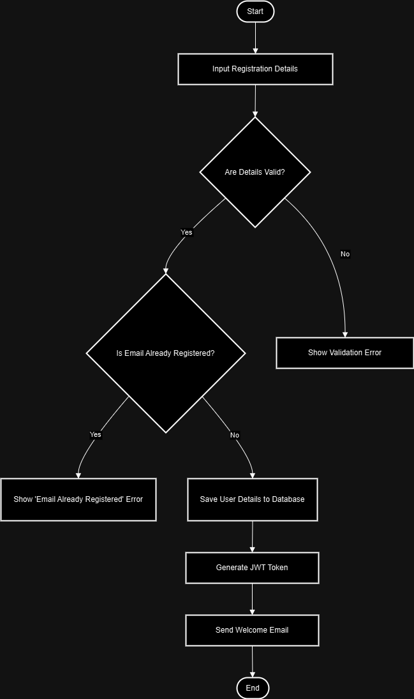

# Flowcharts

## Overview

This directory contains flowcharts that visualize key backend workflows and processes in the Airbnb Clone project. Flowcharts help in understanding the system's logic and data flow for specific features or functionalities.

---

## Included Flowcharts

### 1. User Registration

- **Description**: This flowchart visualizes the steps involved in user registration, including data input, validation, duplicate checks, and token generation.
- **File**: `user-registration.png`

### 2. Property Booking _(Optional Placeholder for Future Expansion)_

- **Description**: This flowchart maps the workflow for booking a property, covering search, availability checks, and payment processing.
- **File**: `property-booking.png` _(Add this file when implemented)_

---

## File Information

### Current Files

- **`user-registration.png`**: Visualizes the User Registration process.

---

## How to View

1. Open the PNG files listed above to view the flowcharts.
2. Use these flowcharts as references for understanding backend workflows.

---

## Directory Structure

```

alx-airbnb-project-documentation/
└── flowcharts/
├── user-registration.png
├── README.md

```


