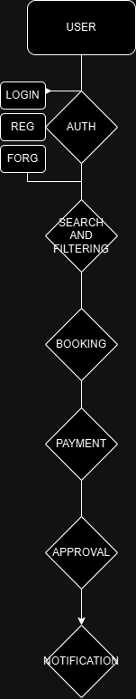

**Use Case Diagram**

```markdown
# Use Case Diagram: Airbnb Clone Features and Functionalities

## Overview

This document contains the **Use Case Diagram** for the Airbnb Clone project. The diagram visualizes the interactions between users (guests, hosts, admins) and the backend system, showcasing the key functionalities such as user registration, property management, booking system, and payment integration.

---

## Actors

The primary actors in the system are:

- **Guest**: A user who browses properties, books stays, and leaves reviews.
- **Host**: A user who lists properties, manages bookings, and receives payments.
- **Admin**: A system administrator who monitors and manages platform activities.

---

## Key Use Cases

- **User Registration**: Guests and Hosts can register and log in.
- **Property Management**: Hosts can add, edit, or delete property listings.
- **Search and Filter**: Guests can search for properties by location, price, and amenities.
- **Booking Management**: Guests can book properties, and Hosts can manage booking requests.
- **Payment Processing**: Guests make payments, and Hosts receive payouts.
- **Review System**: Guests can leave reviews and ratings for properties.
- **Admin Monitoring**: Admins can monitor users, bookings, and transactions.

---

## Diagram

Below is the **Use Case Diagram** representing the interactions:



---

## Instructions

To view the diagram:

1. Open the file `use-case-diagram.png` located in this directory.
2. The diagram was created using [Draw.io](https://app.diagrams.net/), visualizing all key actors and their interactions with the system.

---

## Directory Structure
```

alx-airbnb-project-documentation/
└── use-case-diagram/
├── use-case-diagram.png
├── README.md

```

---

## Task Status
- **Diagram Completed:** ✅
- **Actors Identified:** ✅
- **Key Interactions Mapped:** ✅
```
